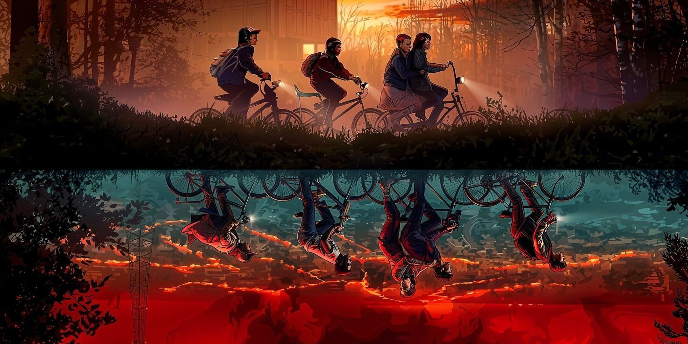

<div align="center">
  
</div>

<h1 align="center">📡 TechnoFest 2026: The Upside Down</h1>

<p align="center">
  <strong>The flagship technical symposium of the AI & DS Department at Late G. N. Sapkal College of Engineering.</strong>
</p>

## 🌌 About The Event
Scheduled for **April 18th, 2026**, TechnoFest is a high-octane platform where academic excellence meets cyberpunk and retro 80s innovation. The event pushes the boundaries of students in the Artificial Intelligence and Data Science fields through intense competition, collaboration, and skill showcase.

### 🏆 Featured Competitions
- **Project Competition:** Unleash the power of data and intelligence to solve real-world problems.
- **AI Prompting:** Master the art of conversation with machines.
- **Free Fire:** Survival of the fittest in the digital battleground.
- **Neon Cricket:** The gentleman's game, reimagined in the neon glow.

---

## 🛠️ Tech Stack
This repository contains the front-end web application for the event's registration and information portal.
- **Framework:** React + Vite
- **Styling:** Tailwind CSS
- **Animations:** Framer Motion
- **Icons:** Lucide React

---

## 🚀 Getting Started

Follow these instructions to run the application locally.

### Prerequisites
- [Node.js](https://nodejs.org/) (v16 or higher recommended)
- npm or yarn

### Installation

1. **Clone the repository (or download the source):**
   ```bash
   git clone <repository-url>
   cd TechnoFest-26
   ```

2. **Install all dependencies:**
   ```bash
   npm install
   ```

3. **Start the development server:**
   ```bash
   npm run dev
   ```

4. Open `http://localhost:5173` (or the port provided by Vite in your terminal) to view the application in the browser.

---

## 🤝 Project Coordinators
- **Staff Coordinator:** Prof. S. D. Bagade
- **Student Coordinator:** Mr. Bhavesh D. Patil

<div align="center">
  <p><i>"Step into the Upside Down of Innovation"</i></p>
</div>
